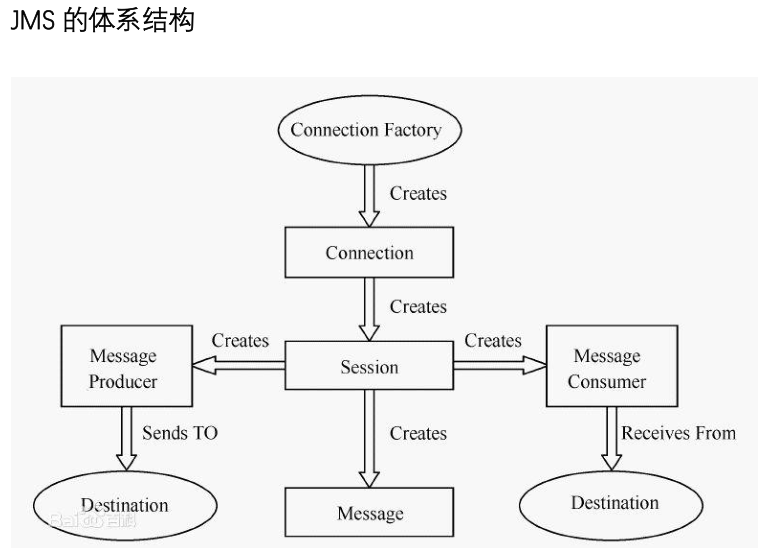

# 分布式消息通信ActiveMQ的初步认识
## 初步认识消息中间件及其发展
### 1.什么是消息中间件？
*消息中间件是值利用高效可靠的消息传递机制进行平台无
     关的数据交流，并基于数据通信来进行分布式系统的集成。
     通过提供消息传递和消息排队模型，可以在分布式架构下
     扩展进程之间的通信*

### 2.消息中间件能做什么？
*实现异步化，秒杀分流*

# ActiveMQ简介

*ActiveMQ 是完全基于 JMS 规范实现的一个消息中间件产品。是 Apache 开源基金会研发的消息中间件。ActiveMQ主要应用在分布式系统架构中，帮助构建高可用、高性能、可伸缩的企业级面向消息服务的系统*
## ActiveMQ 特性
#### 1. 多语言和协议编写客户端
    语言：java/C/C++/C#/Ruby/Perl/Python/PHP
    应 用 协 议 :openwire/stomp/REST/ws/notification/XMPP/AMQP
#### 2. 完全支持 jms1.1 和 J2ee1.4 规范

#### 3. 对 spring 的支持
    ActiveMQ 可以很容易内嵌到 spring模块中

消息中间件的应用场景

## JMS的基本概念和模型
    Java 消息服务（Java Message Service）是 java 平台中关于面向消息中间件的 API，
    用于在两个应用程序之间，或者分布式系统中发送消息，进行异步通信。
    JMS 是一个与具体平台无关的 API，绝大多数 MOM（Message Oriented Middleware）（面向消息中间件）
    提供商都对 JMS 提供了支持。ActiveMQ 就是其中一种实现
## JMS体系结构

### JMS消息头
    消息头(Header) - 消息头包含消息的识别信息和路由信息，
    消息头包含一些标准的属性如：
    JMSDestination 消息发送的目的地，queue或者topic)
    JMSDeliveryMode 传送模式。持久模式和非持久模式
    JMSPriority 消息优先级（优先级分为 10 个级别，
    从 0(最低)到 9(最高). 如果不设定优先级，默认级别是 4。
    需要注意的是，JMS provider 并不一定保证按照优先级的
    顺序提交消息）
    JMSMessageID 唯一识别每个消息的标识

### JMS5种消息体
    Byte,Text,Map,Stream,Object
    TextMessage  java.lang.String 对象，如 xml 文件内容
    MapMessage  名/值对的集合，名是 String 对象，值类型可以是 Java 任何基本类型
    BytesMessage  字节流
    StreamMessage  Java 中的输入输出流
    ObjectMessage  Java 中的可序列化对象
    Message  没有消息体，只有消息头和属性。
### JMS属性
    按类型可以分为应用设置的属性，标准属性和消息中间件定义的属性
######1. 应用程序设置和添加的属性:
    Message.setStringProperty(“key”,”value”);
    通过下面的代码可以获得自定义属性的，在接收端的代码中编写在发送端，
    定义消息属性
    message.setStringProperty("Mic","Hello World");
    在接收端接收数据
    Enumeration enumeration=message.getPropertyNames();
    while(enumeration.hasMoreElements()){
        String name=enumeration.nextElement().toString();
        System.out.println("name:"+name+":"+messag
        e.getStringProperty(name));
        System.out.println();
    }
######2. JMS 定义的属性: 
    使用“JMSX”作为属性名的前缀，通过下面这段代码可以
    返回所有连接支持的 JMSX 属性的名字
    Enumeration names = connection.getMetaData().getJMSXPropertyNames();
    while (names.hasMoreElements()){
        String name = (String)names.nextElement();
        System.out.println(name);
    }
######3.JMS provider 特定的属性:

### JMS消息传递域
p2p(点对点)，pub/sub（发布-订阅）

### JMS发布订阅
    持久订阅者和非持久订阅者
    都是针对pub/sub 消息域来说
    持久订阅是可以收到离线消息，具有时间无关性
    非持久订阅是只能收到及时消息，是时间相关性
    代码实现：
    提供者； producer.setDeliveryMode(DeliveryMode.PERSISTENT);
            
    消费者：
        connection.setClientID("Mic-001");
        MessageConsumer consumer=session.createDurableSubscriber(destination,"Mic-001");

### JMS消息的可靠性机制
    jms具有事务性，jms在创建Session时候可以指定其是否具有事务性：connection.createSession(Boolean.TRUE,Session.AUTO_ACKNOWLEDGE);
    非事务性Session中事务自动提交和session的模式无关
    事务性事务Session事务应答方式常用有三种： 
        Session.AUTO_ACKNOWLEDGE;//收到信息自动确认
        Session.CLIENT_ACKNOWLEDGE;//客户端确认
        Session.DUPS_OK_ACKNOWLEDGE;//延迟确认
    
    消息持久化：
        持久消息，消息提供者会使用存储-转发机制，先将消息存储到稳定介质中，等消息发送成功后再删除。如果 jms provider 挂掉了，
    那么这些未送达的消息不会丢失；jms provider 恢复正常后，会重新读取这些消息，并传送给对应的消费者。
        非持久的消息，JMS provider 不会将它存到文件/数据库等稳定的存储介质中。也就是说非持久消息驻留在内存中，如果 jms provider 宕机，那么内存中的非持久
    消息会丢失。
    代码实现；
        producer.setDeliveryMode(DeliveryMode.PERSISTENT);
        producer.setDeliveryMode(DeliveryMode.NON_PERSISTENT);

### 消息重发机制

分布式消息通信ActiveMQ的核心功能分析
> 生产者消息发送策略

ActiveMQ整合Spring

ActiveMQ传输协议

ActiveMQ消息持久化存储

ActiveMQ多节点高可用高性能方案

分布式消息通信ActiveMQ的及实战应用

ActiveMQ客户端故障转移

ActiveMQ的整体流程

ActiveMQ常见问题

ActiveMQ结合业务功能开发